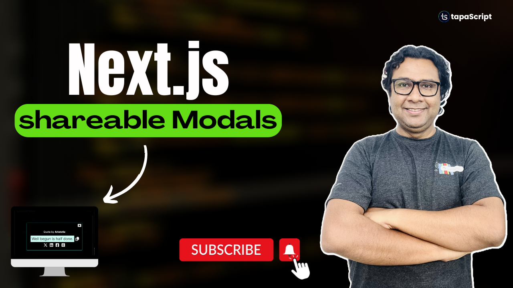
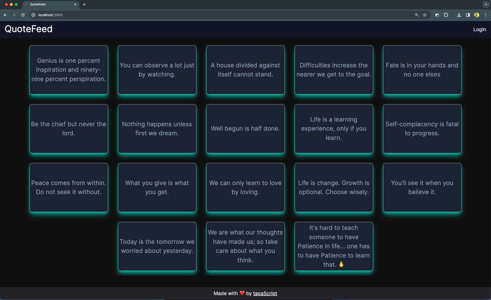
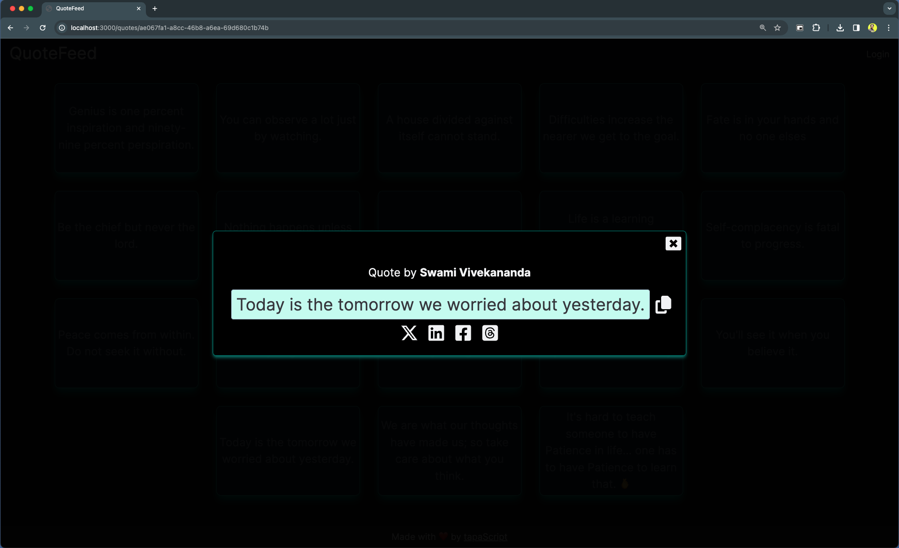

## How to Build a Shreable Modal Content with Intercepting Routes and Parallel Routes from the Next.js App Router?

The source code in this repository has been used to teach a Next.js topic. 

## Please find the video here:

<a href="https://youtu.be/v02LJJMz_sc" title="shreable-modal-content"></a>

## 🫶 Support
Liked it? You can show your support with a STAR(⭐).

### Many Thanks to all the `Stargazers` who have supported this project with stars(⭐)

[](https://github.com/tapascript/next-quotes/stargazers)

### Sponsor My Work

I am an independent educator who creates meaningful projects to teach programming. You can support me further by [sponsoring me on GitHub](https://github.com/sponsors/atapas).


## Running the app locally

First, install the dependencies

```bash
npm install
# or
yarn
#or
pnpm install
```

Then, run the development server:

```bash
npm run dev
# or
yarn dev
# or
pnpm dev
```

Open [http://localhost:3000](http://localhost:3000) with your browser to see the result.

### The Quote List Page

<a href="https://youtu.be/v02LJJMz_sc" title="quote-list"></a>

### The Modal

<a href="https://youtu.be/v02LJJMz_sc" title="quote-modal"></a>

## Learn More

To learn more about Next.js, take a look at the following resources:

- [Full Stack With Next.js App Router](https://www.youtube.com/watch?v=VSB2h7mVhPg&list=PLIJrr73KDmRwz_7QUvQ9Az82aDM9I8L_8) - A Next.js App Router Playlist
- [Next.js Documentation](https://nextjs.org/docs) - learn about Next.js features and API.
